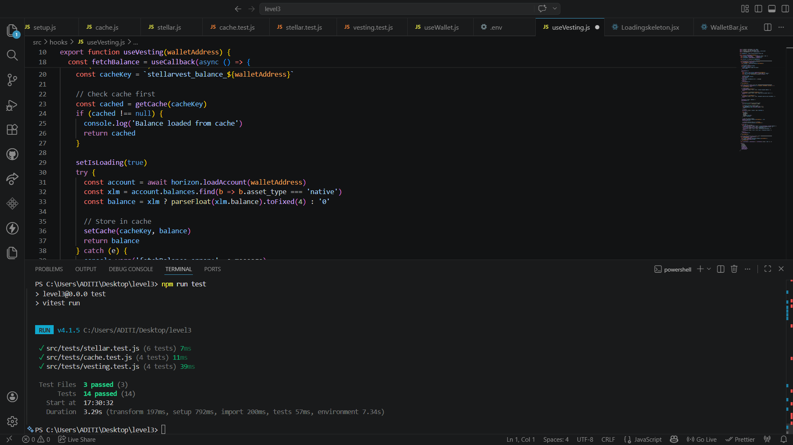
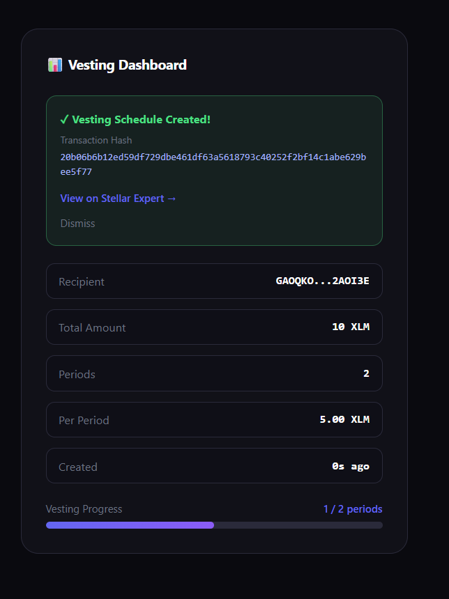

# 🔒 StellarVest — Token Vesting dApp

**Stellar Frontend Challenge — Level 3: Orange Belt**

A complete token vesting mini-dApp built on Stellar Testnet with loading states, caching, 14 passing tests, and full documentation.

---

## ✨ Features

| Requirement | Implementation |
|---|---|
| **Mini-dApp functional** | Create vesting schedules with recipient, amount, periods |
| **Loading states** | Skeleton loaders + pending spinner on every async action |
| **Caching** | localStorage cache with 30s TTL for balance + vesting data |
| **3+ tests passing** | 14 tests across cache, stellar utils, and vesting logic |
| **Complete README** | This file |
| **Demo video** | See link below |

---

## 🗂 Project Structure

```
stellar-vesting/
├── src/
│   ├── hooks/
│   │   ├── useWallet.js        # Freighter wallet connection
│   │   └── useVesting.js       # Vesting logic + caching
│   ├── components/
│   │   ├── WalletBar.jsx       # Wallet connect UI + balance
│   │   ├── VestingForm.jsx     # Create vesting schedule form
│   │   ├── VestingDashboard.jsx # Dashboard + tx status
│   │   └── LoadingSkeleton.jsx # Skeleton loading components
│   ├── utils/
│   │   ├── cache.js            # localStorage cache utility
│   │   └── stellar.js          # Stellar helper functions
│   ├── tests/
│   │   ├── setup.js            # Test setup
│   │   ├── cache.test.js       # Cache utility tests
│   │   ├── stellar.test.js     # Stellar utils tests
│   │   └── vesting.test.js     # Vesting logic tests
│   └── App.jsx
└── README.md
```

---

## 🚀 Setup Instructions

### 1. Prerequisites
- [Node.js](https://nodejs.org) v18+
- [Freighter Wallet](https://www.freighter.app/) set to **Testnet**
- Testnet XLM from [Friendbot](https://friendbot.stellar.org/)

### 2. Clone & Install
```bash
git clone https://github.com/AditiM1729/stellar-vesting
cd stellar-vesting
npm install --legacy-peer-deps
```

### 3. Run locally
```bash
npm run dev
```
Open http://localhost:5173

### 4. Run tests
```bash
npm run test
```

---

## 🧪 Tests

14 tests passing across 3 test files:

**cache.test.js** — localStorage cache utility
- stores and retrieves data
- returns null for missing keys
- clears specific keys
- clears all cache keys

**stellar.test.js** — Stellar utility functions
- shortens addresses correctly
- validates correct Stellar addresses
- rejects invalid addresses
- converts XLM to stroops
- converts stroops to XLM
- builds correct explorer URLs

**vesting.test.js** — Vesting business logic
- validates recipient address
- calculates correct vesting amounts
- caches and retrieves vesting schedule
- formats XLM amounts for display

### Screenshot — All tests passing


---

## 🎬 Demo Video

[Watch demo](https://www.loom.com/share/c7daa5e7356f4051b5b6cd4c45fae444)

---

## 📸 Screenshots

### Vesting Dashboard


---

## 📋 Submission Details

| Item | Value |
|---|---|
| **Network** | Stellar Testnet |
| **Wallet** | Freighter |
| **Live Demo** | [stellar-vesting.surge.sh](https://stellar-vesting.surge.sh) |
| **Tests** | 14 passing |

---

## 🛠 Technical Highlights

### Loading States
Three types of loading indicators:
- `BalanceSkeleton` — animated placeholder while fetching XLM balance
- `CardSkeleton` — full card placeholder on initial load
- `LoadingSkeleton` — line placeholders for content areas
- Pending spinner in dashboard during transaction

### Caching Implementation
`src/utils/cache.js` implements localStorage caching with:
- 30 second TTL (time-to-live)
- Automatic expiry on read
- Per-wallet balance caching
- Per-wallet vesting schedule caching
- Cache invalidation after transactions

### Error Handling
Three error types handled:
1. **Wallet Not Found** — Freighter not installed
2. **User Rejected** — Connection or tx rejected
3. **Insufficient Balance** — Not enough XLM

---

## 🔗 Resources
- [Stellar Docs](https://developers.stellar.org)
- [Soroban Docs](https://soroban.stellar.org)
- [Freighter Wallet](https://www.freighter.app)
- [Stellar Expert Testnet](https://stellar.expert/explorer/testnet)